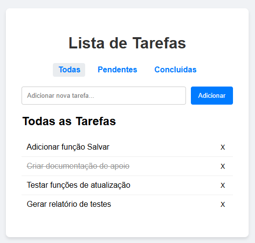

# 📝 Lista de Tarefas (To-Do List React)

Este projeto é uma aplicação web de Lista de Tarefas construída com **React**, **Vite** e **React Router DOM**. Ele serve como um guia prático para iniciantes no desenvolvimento front-end, focando em conceitos essenciais como a criação de componentes, gerenciamento de estado e navegação entre rotas.

Desenvolvido por: Emmanoel Monteiro



## ✨ Funcionalidades

- **Adicionar Tarefas:** Crie novas tarefas de forma rápida e intuitiva.
- **Marcar como Concluída:** Alterne o status de uma tarefa entre pendente e concluída.
- **Remover Tarefas:** Exclua tarefas da lista quando não forem mais necessárias.
- **Navegação por Rota:** Visualize a lista completa de tarefas, apenas as pendentes ou somente as concluídas através de rotas de navegação dedicadas.

## 🛠️ Tecnologias Utilizadas

- **React:** Biblioteca JavaScript para construir interfaces de usuário.
- **Vite:** Ferramenta de build extremamente rápida para projetos front-end.
- **React Router DOM:** Biblioteca para gerenciar a navegação e as rotas da aplicação.
- **JavaScript:** Linguagem de programação principal.
- **CSS:** Para estilização e design da interface.

## 🚀 Como Rodar o Projeto

Siga estes passos para configurar e executar a aplicação em sua máquina local.

### 1. Pré-requisitos

Certifique-se de ter o **Node.js** e o **npm** (gerenciador de pacotes do Node) instalados. Você pode verificar suas versões com os seguintes comandos:

```bash
node -v
npm -v
```
### 2. Clonar o Repositório

```bash
git clone [https://github.com/seu-usuario/to-do-list-react.git](https://github.com/seu-usuario/to-do-list-react.git)
```

### 3. Instalar as Dependências
Navegue até o diretório do projeto e instale todas as dependências necessárias, incluindo o React Router DOM.

```bash
cd meu-to-do-list
npm install
```

### 4. Executar a Aplicação

Inicie o servidor de desenvolvimento. A aplicação estará disponível no seu navegador em `http://localhost:5173`.

```bash
npm run dev
```
Agora você está pronto para explorar e modificar o código!

## 📂 Estrutura de Arquivos

A organização do projeto foi pensada para facilitar o entendimento dos conceitos de componentes e rotas.

```
meu-to-do-list/
├── src/
│   ├── components/
│   │   ├── FormularioDeTarefa.jsx
│   │   ├── ItemDaTarefa.jsx
│   │   ├── ListaDeTarefas.jsx
│   │   └── Header.jsx
│   ├── pages/
│   │   ├── TarefasConcluidas.jsx
│   │   ├── TarefasPendentes.jsx
│   │   └── TodasAsTarefas.jsx
│   ├── App.jsx
│   ├── main.jsx
│   └── index.css
├── package.json
└── README.md
```

## 🧠 Conceitos Abordados

* **Componentes:** O projeto é dividido em pequenos componentes reutilizáveis, como FormularioDeTarefa e ItemDaTarefa.

* **Estado (State):** O useState é usado para gerenciar a lista de tarefas e a entrada do usuário no formulário.

* **Props:** As propriedades (props) são utilizadas para passar dados e funções entre os componentes, garantindo a comunicação entre eles.

* **Rotas:** O React Router DOM é fundamental para criar rotas que filtram e exibem as tarefas de acordo com seu status (/, /pendentes, /concluidas).